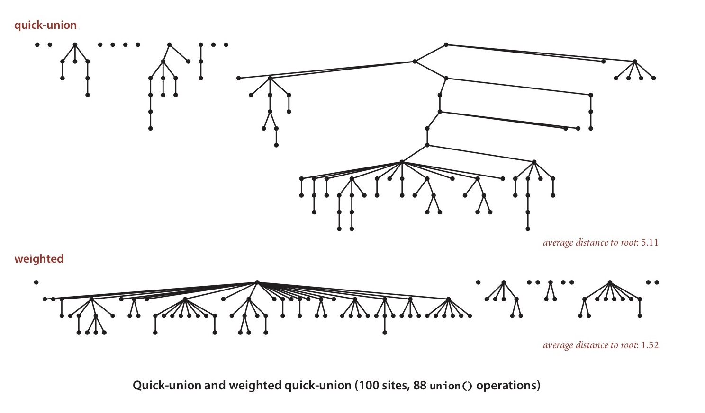
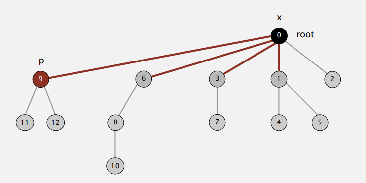

### Quick Find
idea is to assign all the items in 1 connected component with 1 same id. p and q are connected if they have the same id. Every time we do the union command, we update those 2 items with the same id

### Quick Union
We need an array for all the items. The values are still the id, but it’s the id of the parent item. The connected component is organised using a tree structure

### Weighted Quick Union
* maintain extra array sz[i] to count number of objects in the tree rooted at i
* link root of smaller tree to root of larger tree
* size of the new tree is the total size of both tree
* complexity  lg N ( base-2 logarithm)


### Quick union with path compression
* just after computing the root of p, set the id of each examined node to point to that root ( every other node in path point to its grandparent)
* worst-case time: N + M lg* N



### Related Interview Questions

#### Social network connectivity. 
Given a social network containing nn members and a log file containing mm timestamps at which times pairs of members formed friendships, design an algorithm to determine the earliest time at which all members are connected (i.e., every member is a friend of a friend of a friend ... of a friend). Assume that the log file is sorted by timestamp and that friendship is an equivalence relation. The running time of your algorithm should be m \log nmlogn or better and use extra space proportional to n


The earliest time at which all members are connected is when we union all into 1 connected component, `isAllConnected` returns `true`. Since N is number of components to be connected, this will be our initial count to decrease.
```
public class QuickUnionUF
{
 private int[] id;
 private int[] sz;
 public int count;
 public QuickUnionUF(int N, int[] time, int[][] con)
 {
 id = new int[N];
 sz = new int[N];
count = N;
 for (int i = 0; i < N; i++)  id[i] = i; sz[i] = 1;
 }
 private int root(int i)
 {
 while (i != id[i]) i = id[i];
 return i;
 }
 public boolean connected(int p, int q)
 {
 return root(p) == root(q);
 }
public boolean isAllConnected() {
		return count == 1;
}
 public void union(int p, int q)
 {
 int i = root(p);
 int j = root(q);
 if (i == j) return;
 if (sz[i] < sz[j]) { id[i] = j; sz[j] += sz[i]; }
 else { id[j] = i; sz[i] += sz[j]; } 
 }
count --;
}
```

#### Union-find with specific canonical element
Add a method find() to the union-find data type so that find(i) returns the largest element in the connected component containing i. The operations union(), connected() and find() should all take logarithmic time or better.
For example, if one of the connected components is {1, 2, 6, 9} then the find() method should return 9 for each of the four elements in the connected components.

1. add array `int[] largest` to store the largest number for each connected component
2. update the largest number when call `union`
```
 private int[] largest;
 public void union(int p, int q)
 {
 int i = root(p);
 int j = root(q);
 if (i == j) return;
 if (sz[i] < sz[j]) { id[i] = j; sz[j] += sz[i]; }
 else { id[j] = i; sz[i] += sz[j]; } 
int max;
if(i>j); max = i;
else max = j;
largest[i] = largest [j] = max;
 }
}

public int find(int i){
return largest[i];
}
```


#### Successor with delete

Given a set of n integers S={0,1,...,n−1} and a sequence of requests of the following form: Remove x from S. Find the successor of x: the smallest y in S such that y≥x. Design a data type so that all operations (except construction) take logarithmic time or better in the worst case.

remove operation acts like union (x, x+1)
successor of x is the next value, can be saved in `successorArr`
```
 public void union(int p, int q)
 {
 int i = root(p);
 int j = root(q);
 if (i == j) return;
 if (sz[i] < sz[j]) { id[i] = j; sz[j] += sz[i]; }
 else { 
     id[j] = i; sz[i] += sz[j]; 
     successorArr[i] = j;
    } 
 }
}
```